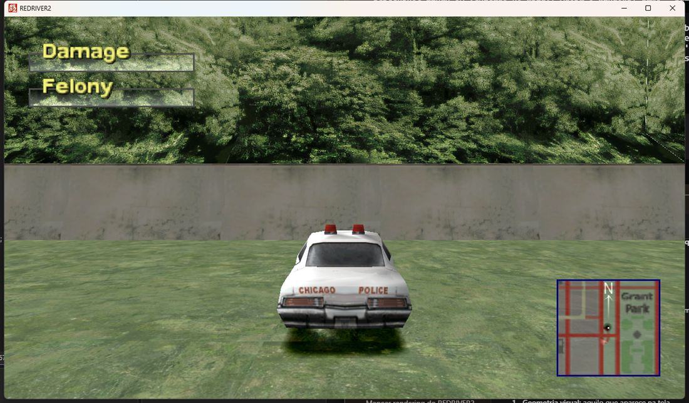
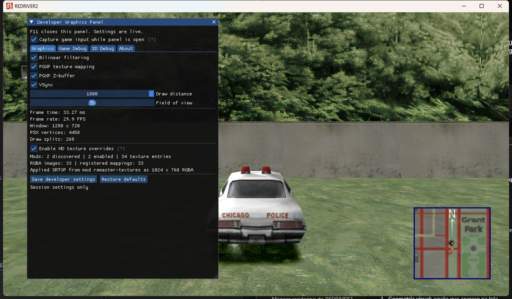
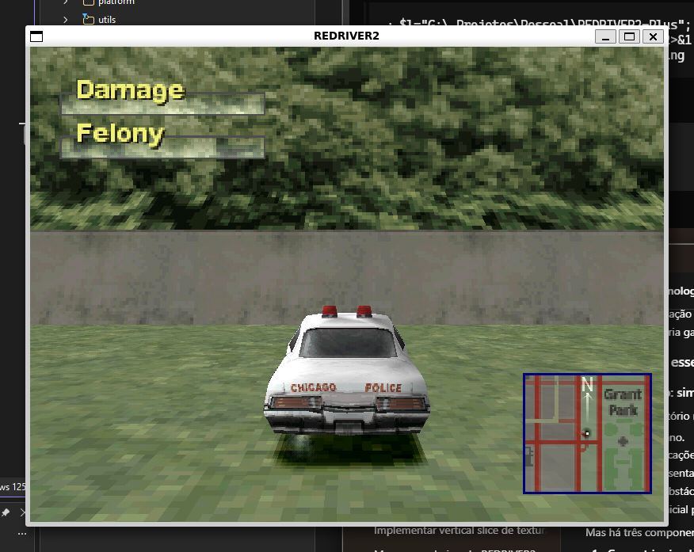

# Building and running REDRIVER2-Plus

This document covers prerequisites, dependencies, build and run steps for
Windows and Linux (native, or on Windows through WSL/WSLg). For what the
project is, see the main [README](README.md).

## Contents

- [Prerequisites](#prerequisites)
- [Game data](#game-data)
- [Build on Windows](#build-on-windows)
- [Build on Linux](#build-on-linux)
- [Build on Linux through WSL](#build-on-linux-through-wsl)
- [Running the game](#running-the-game)
- [Configurations](#configurations)
- [Deterministic debug start](#deterministic-debug-start)
- [Running the export tests](#running-the-export-tests)
- [Screenshots](#screenshots)
- [Troubleshooting](#troubleshooting)

## Prerequisites

Common to every platform:

- **Git** with submodule support.
- **A legal *Driver 2* data set.** The repository ships code only; see
  [Game data](#game-data).
- About **2 GB** of free disk space and network access for the first prepare
  step (build dependencies are downloaded once).

### Windows

- **Visual Studio 2022** with the **Desktop development with C++** workload
  (MSVC v143 and a Windows 10/11 SDK).
- **PowerShell** (Windows PowerShell 5.1 or PowerShell 7). The scripts work in
  both; `scripts/run_debug_start.ps1` prefers `pwsh`.
- Optional: `msbuild` on `PATH` for command-line builds. It is available from a
  *Developer Command Prompt for VS 2022*, or through
  `"C:\Program Files\Microsoft Visual Studio\2022\Community\Common7\Tools\VsDevCmd.bat"`.

### Linux

Ubuntu 20.04+ or Debian, with GCC/Clang and `make`. The game links the system
**SDL2**, **OpenAL**, **OpenGL** and **libjpeg** (the bundled `jpeg` project is
Windows-only):

```bash
sudo apt-get update
sudo apt-get install -y build-essential libsdl2-dev libopenal-dev \
    libgl1-mesa-dev libjpeg-dev pkg-config
```

Other distributions need the equivalent development packages for SDL2, OpenAL
Soft, OpenGL and libjpeg.

### WSL

WSL2 on Windows 11 with **WSLg** (bundled since Windows 11). Verify and update:

```powershell
wsl --install
wsl --update
wsl -l -v
```

## Game data

The repository does not contain the commercial game data and does not grant a
license to use it. Prepare your own legally obtained *Driver 2* data following
the upstream [installation instructions](https://github.com/OpenDriver2/REDRIVER2/wiki/Installation-instructions).

By default the game looks for a `DRIVER2/` folder in its working directory.
Keep the prepared data at the repository's `data/DRIVER2` and link or copy it
next to the executable, or point `RED2_DIR` at it.

## Build on Windows

### 1. Clone with submodules

```powershell
git clone --recurse-submodules https://github.com/SimStm/REDRIVER2-Plus.git
Set-Location REDRIVER2-Plus
```

If you cloned without submodules:

```powershell
git submodule update --init --recursive
```

### 2. Prepare dependencies and generate the solution

```powershell
.\windows_dev_prepare.ps1
```

The script downloads and extracts, skipping anything already present:

| Dependency | Version | Location |
| --- | --- | --- |
| Premake | 5.0.0-beta1 | `src_rebuild/premake5.exe` |
| SDL2 (VC) | 2.30.2 | `src_rebuild/dependencies/SDL2-2.30.2` |
| OpenAL Soft | 1.23.1 | `src_rebuild/dependencies/openal-soft-1.23.1-bin` |
| libjpeg | 9d | `src_rebuild/dependencies/jpeg-9d` |

It then renames `jpeg-9d/jconfig.vc` to `jconfig.h`, applies the project-owned
PsyCross patch, runs `premake5 vs2022`, and opens
`src_rebuild/build/REDRIVER2.sln`.

> The downloaded archives (`PREMAKE.zip`, `SDL2.zip`, `OPENAL.zip`,
> `JPEG.zip`) are untracked build inputs and must not be committed.

### 3. Build

In Visual Studio, select the **`Release_dev`** configuration and **`x64`**
platform, make `REDRIVER2` the startup project, and build. From a Developer
Command Prompt:

```powershell
msbuild src_rebuild\build\REDRIVER2.sln /p:Configuration=Release_dev /p:Platform=x64 /m
```

The executable is written to:

```text
src_rebuild/bin/Release_dev/REDRIVER2_dev.exe
```

## Build on Linux

### 1. Install dependencies

See [Prerequisites → Linux](#linux).

### 2. Clone and initialize the submodule

```bash
git clone --recurse-submodules https://github.com/SimStm/REDRIVER2-Plus.git
cd REDRIVER2-Plus
# or, in an existing clone
git submodule update --init --recursive
```

### 3. Generate the makefiles

```bash
./linux_dev_prepare.sh
```

The script downloads Premake 5 beta1 for Linux (if missing), applies the
PsyCross patch, and runs `premake5 gmake2`/`vscode` into `src_rebuild/build`.

### 4. Build

```bash
cd src_rebuild/build
make -j"$(nproc)" config=release_dev_x64
```

Available configurations: `debug_x86`, `debug_x64`, `release_x86`,
`release_x64`, `release_dev_x86`, `release_dev_x64`. The binaries are written
to `src_rebuild/bin/<Configuration>/`.

## Build on Linux through WSL

The steps are the same as a native Linux build. Build inside the Linux
filesystem for speed, not under `/mnt/c` or `/mnt/g`:

```bash
# inside the WSL shell
sudo apt-get update
sudo apt-get install -y build-essential libsdl2-dev libopenal-dev \
    libgl1-mesa-dev libjpeg-dev pkg-config

git clone --recurse-submodules \
    /mnt/g/_Projetos/Pessoal/REDRIVER2-Plus ~/rdr2-linux
cd ~/rdr2-linux
./linux_dev_prepare.sh
cd src_rebuild/build
make -j"$(nproc)" config=release_dev_x64
```

WSLg supplies the display automatically (`echo $DISPLAY` shows `:0`), so the
game opens a normal window on the Windows desktop. This is the Linux build in
the [screenshot below](#screenshots).

Notes:

- If `sudo` asks for a password you do not have, install packages from Windows
  with `wsl -u root -- apt-get install -y <packages>`.
- When cloning from a Windows drive you may see *detected dubious ownership*;
  run `git config --global --add safe.directory '*'`.
- To keep the game running after the launching shell exits, start it detached:
  `setsid nohup ./REDRIVER2_dev -nointro >/tmp/g.log 2>&1 </dev/null &`.

## Running the game

The working directory matters: the game resolves `DRIVER2/` and reads
`config.ini`, `mods/` and `developer_debug_start.ini` from there.

### Windows

- **From Visual Studio:** press `F5`. The generated project sets the debugger
  **Working Directory** to `src_rebuild/bin/<Configuration>`, so keep the data
  and config there, or set `RED2_DIR`.
- **From the command line:**

```powershell
Set-Location src_rebuild\bin\Release_dev
.\REDRIVER2_dev.exe
```

Create a `DRIVER2` junction/symlink pointing at the repository data if it is
not already there:

```powershell
New-Item -ItemType Junction -Path DRIVER2 -Target ..\..\..\..\data\DRIVER2
```

### Linux

```bash
cd src_rebuild/bin/Release_dev
ln -sfn /path/to/repo/data/DRIVER2 DRIVER2
./REDRIVER2_dev
```

Under WSLg the window appears on the Windows desktop. If audio is unavailable,
run with `SDL_AUDIODRIVER=dummy`.

## Configurations

| Configuration | Suffix | Output | Debug options | Notes |
| --- | --- | --- | --- | --- |
| `Debug` | `_dbg` | `REDRIVER2_dbg` | Yes | Symbols, `COLLISION_DEBUG`, `CUTSCENE_RECORDER` |
| `Release_dev` | `_dev` | `REDRIVER2_dev` | Yes | Optimized, symbols, debug options |
| `Release` | none | `REDRIVER2` | Only `-nointro`, `-nofmv`, `-replay` | Optimized |

**"Debug options"** means the direct-start arguments below. Use `Release_dev`
for normal testing; plain `Release` cannot start a specific mission from the
command line.

## Deterministic debug start

`Debug` and `Release_dev` are built with `DEBUG_OPTIONS`, so they accept
direct-start arguments and skip the frontend and intro:

```text
REDRIVER2_dev -nointro -mission <N> -gametype <G> -level <L> -playercar <C> -startpos <x> <z> -startdir <A> -players <P> [-chase <H>]
REDRIVER2_dev -nointro -replay "DRIVER2/REPLAYS/ATTRACT.400"
```

- `-mission`, `-gametype`, `-level`, `-playercar`, `-startpos`, `-startdir`,
  `-players`, `-chase` start a specific session.
- `-startdir` is the player heading as a 12-bit PlayStation angle (`0..4095`).
- `-gametype` and `-level` are required for a faithful reproduction:
  `GAME_TAKEADRIVE` recomputes the mission number from `GameLevel`, so
  `-mission` alone does not select the map.
- `-replay <file.d2rp>` plays a recorded replay and also works in a plain
  `Release` build. Attract replays under `data/DRIVER2/REPLAYS/` are the most
  reproducible choice when comparing a setting on and off. Scripted
  "Undercover" missions reload through the mission ladder and are not exactly
  restored by the direct-start arguments.

The **Game Debug** tab of the developer panel has a **Reproduce this state**
section. It captures the current mission, game type, level, vehicle, position,
heading, players and chase; copies the matching command line; and saves it to
`developer_debug_start.ini`. With `enabled=1`, a debug build applies it at
startup, skipping the frontend and intro, unless `-mission` or `-replay` was
given.

[`scripts/run_debug_start.ps1`](scripts/run_debug_start.ps1) (Windows) launches
from explicit arguments, the saved snapshot, or a replay, and can capture the
same scene with overrides on and off:

```powershell
pwsh -File scripts/run_debug_start.ps1 -Mission 1 -Car 0 -X 0 -Z 0
pwsh -File scripts/run_debug_start.ps1 -FromSnapshot
pwsh -File scripts/run_debug_start.ps1 -Mission 1 -Car 0 -X 0 -Z 0 -Capture
```

Capture mode writes `src_rebuild/build/debug-start-captures/overrides-1.bmp`
and `overrides-0.bmp`. It uses these config keys instead of input injection:

- `[game] captureAfterSeconds=<seconds>` — save `SCREENSHOT.BMP` once after
  entering gameplay (`0` disables it).
- `[render] textureOverrides=0|1` — initial HD texture override state
  (default `1`).

On Linux, pass the same arguments directly to the binary; the capture keys work
identically.

## Running the export tests

The inspector export tests are a standalone executable and need no game data or
OpenGL context. On Windows:

```powershell
cd src_rebuild
cl /nologo /EHsc /std:c++14 /O2 /Gy ^
  /I dependencies\SDL2-2.30.2\include /I PsyCross\include /I PsyCross\include\psx ^
  tests\InspectorExportTests.cpp ^
  /Fo:build\InspectorExportTests.obj /Fe:build\InspectorExportTests.exe ^
  /link /OPT:REF ole32.lib uuid.lib windowscodecs.lib
build\InspectorExportTests.exe
```

Run the executable from an empty directory so its `mods/` fixtures are created
in isolation. See [`src_rebuild/tests/README.md`](src_rebuild/tests/README.md).

## Screenshots

Windows `Release_dev`, started directly at the Chicago debug-start scene:



The F11 developer panel over the same session:



The same build/level on Linux, running through WSLg in a Windows desktop
window:



## Troubleshooting

| Symptom | Cause and fix |
| --- | --- |
| `PsyCross is not initialised` | Submodule missing: `git submodule update --init --recursive`. |
| Patch fails to apply | The submodule is not at the pinned revision, or the patch file was line-ending converted. Re-check `git -C src_rebuild/PsyCross status` and re-apply `scripts/apply_psycross_patches.ps1` (Windows) / `git -C src_rebuild/PsyCross apply <patch>` (Linux). |
| `git diff header lacks filename information` | The patch was checked out with CRLF; `.gitattributes` keeps it LF. Re-checkout `patches/**`. |
| Visual Studio cannot find SDL2/OpenAL headers | Re-run `windows_dev_prepare.ps1` so `SDL2_DIR`/`OPENAL_DIR` are set before Premake runs. |
| Mission arguments do nothing | You are running `Release`; start arguments exist only in `Debug`/`Release_dev`. |
| Black or wrong textures | HD override mods may be mapped to the wrong texture; toggle **Enable HD texture overrides** off in the panel. |
| Linux: `SDL.h: No such file` | Install `libsdl2-dev` (and the other packages above), then re-run `linux_dev_prepare.sh`. |
| WSL: no window appears | Update WSL (`wsl --update`) so WSLg is available; confirm `echo $DISPLAY` prints `:0`. |
| Linux/WSL: no audio | Run with `SDL_AUDIODRIVER=dummy`, or configure WSLg audio. |
| `msbuild` not recognised | Use a Developer Command Prompt, or call `VsDevCmd.bat` first. |
