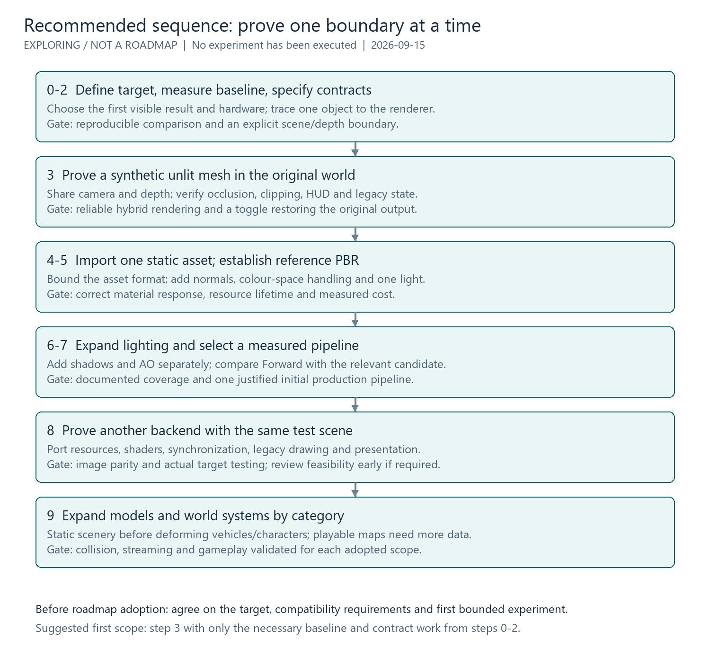

# Recommended sequence for renderer modernization

This is a sequence to discuss, not an adopted roadmap or authorization to run
experiments. No milestones below have been executed as part of this discussion.
See the [main record](index.md) for evidence, assumptions and unresolved decisions.
No calendar estimates or performance numbers are asserted without measurement.

## 0. Define the first product target

Choose a specific result, such as a static custom object with controllable PBR
lighting in an existing city, while preserving the normal game mode. Decide
initial platforms, representative hardware, resolution, frame-time/memory
budgets and the desired visual relationship to the original art.

Treat modern meshes, lighting pipeline, backend portability and playable custom
maps as separate capabilities. Decide what the first experiment actually proves.

**Exit evidence:** a one-page target with a reference scene, success criteria,
fallback behaviour and explicitly deferred features. Numeric budgets are set
with the user and measured hardware, not guessed in this discussion.

## 1. Establish a reproducible baseline and locate the scene boundary

Use existing replay/debug-start tooling to capture day/night, opaque and
transparent geometry, texture overrides, menus and relevant camera variants.
Record CPU submission time, GPU time where available, frame-time distribution,
memory, draw calls, primitive counts and streaming stalls. Match scene state
and settings; distinguish static image checks from longer gameplay checks.

Trace one static object's path from `MODEL` and world placement through
`draw.c`, GTE/PGXP, the primitive stream and the `GR_*` calls. Determine where
normals, transforms, identity and visibility are available or lost. Also inspect
OpenGL calls in window management, readback, videos and ImGui integration.

**Exit evidence:** a measured baseline and a concrete source-level insertion
point. A regression comparison must be reproducible before renderer changes.

## 2. Specify the smallest scene and backend contracts

Define a render-facing snapshot that does not rewrite simulation state:

- Camera/view/projection, coordinate units, handedness, winding, near/far planes
  and depth conventions; account for split-screen viewports if in first scope.
- Persistent mesh/index data, vertex normals, UVs and optional tangents.
- Stable instance identity, object-to-world transforms and lifetime/generation
  rules that survive streaming/reload and prevent stale pointer reuse.
- Material identity, alpha mode, colour-space interpretation and light records.
- Pass boundaries, resource ownership, render targets and diagnostics.

Keep the first backend boundary small but resource-oriented: buffers, textures,
pipelines, passes and presentation. A one-to-one imitation of global OpenGL
state is a poor foundation for Vulkan's explicit lifetime/synchronization model.
Avoid building a general engine, ECS or elaborate render graph before needed.
Preserve C-compatible public hooks and the current language/platform contracts.

**Exit evidence:** an interface sketch tied to actual producers/consumers, with
legacy and modern responsibilities assigned and unresolved depth risks listed.

## 3. Prove one unlit modern object inside the legacy world

Use a synthetic mesh first, without adding an importer dependency. Draw it
through an experimental modern submission path on the existing OpenGL backend
when capabilities permit. Share one device/context and explicit state boundaries.
Do not attempt OpenGL/Vulkan interoperation as the first integration mechanism.

Prove camera alignment, coordinate scale and depth by moving the camera around
the object and behind legacy walls. Test mutual occlusion, near clipping,
opaque/cutout geometry, HUD composition and restoration of legacy GL state.
Account for polygon offsets, ordering-table behaviour, PGXP settings and
offscreen passes. A compatible depth prepass may be necessary; do not assume
the existing buffer can simply be reused for every legacy draw.

This slice does not replace a gameplay object. It must not change collision,
traffic, missions, simulation timing or asset allocations.

**Exit evidence:** repeatable in-game captures, stable depth during motion,
bounded measured cost and a toggle that restores the baseline. If mutual
occlusion cannot be made reliable, revisit this bridge before adding PBR.

## 4. Establish a bounded modern asset path

Evaluate glTF 2.0/GLB for static mesh/material interchange; it is a candidate,
not a selected dependency. Compare offline conversion to an internal format
against runtime loading. Inspect importer dependencies, license, C++ level and
target support before choosing one. Reuse proven project format tooling where
appropriate without making all existing roadmap work a prerequisite.

Specify supported attributes, indices, transforms, normals/tangent generation,
texture colour spaces, material/alpha modes, versioning and unsupported features.
Validate sizes, index ranges and resource lifetimes before exposing loaded data
to rendering. Use owned synthetic fixtures and deterministic diagnostics.

Separate visual asset identity from legacy texture-page addresses and temporary
object pointers. For the first replacement experiment, use a visual-only static
object binding while retaining its existing gameplay/collision representation.
Make any visual/collision mismatch explicit.

**Exit evidence:** one static custom asset imports consistently, survives reload
and unload, rejects unsupported input clearly and draws through the proven bridge.

## 5. Add a reference PBR material and simple Forward lighting

Start with a metallic/roughness model, correct normals, base colour and one
controllable directional or point light. Define world/light units, texture
decoding and linear-light computation. Add an HDR intermediate and controlled
exposure/tone mapping as needed for the desired range; compose legacy content
deliberately so a global colour transform does not silently alter its appearance.

Use a synthetic material test scene: dielectric and metal samples across
roughness values, known normal directions and controlled exposure. Introduce
normal maps only after tangent-space conventions are checked. Add environment
lighting/IBL when needed, with explicit ownership of generated resources.

Leave legacy content in its compatibility shading mode initially. Define an
opt-in conversion policy for assets whose colours already encode lighting.
Avoid two sources of baked and dynamic illumination being applied accidentally.

**Exit evidence:** coherent material response under moving lights, documented
colour-space handling, stable legacy output and measured cost. This reference
Forward path is a baseline for comparison, not the final pipeline commitment.

## 6. Introduce world lighting, shadows and AO independently

Create light instances with colour, intensity, range and transform. Decide how
day/night and existing street-light locations map into the new visual system
without changing gameplay logic. Start with few lights and clear diagnostics.

For shadows, collect relevant casters before main-camera visibility has removed
them. Define caster/receiver coverage across legacy and modern objects; a
modern-only shadow experiment must not claim full-world support. Evaluate
bias, cutout silhouettes, streaming boundaries and far-distance stability.

For screen-space AO, validate depth reconstruction and stored/reconstructed
normals, sky rejection and transparency treatment. Apply it to the appropriate
lighting component and check halos during motion. Introduce temporal techniques
only after camera history and object-motion data have explicit contracts.

**Exit evidence:** each feature can be isolated and disabled, has documented
coverage and captures, and stays within the selected frame-time/memory budget.

## 7. Select a scalable lighting pipeline with measurements

Compare the reference Forward path with the smallest relevant candidate:
Forward+ or clustered light assignment when light count grows, or Deferred
when its surface-buffer and lighting tradeoffs fit the target scenes.

Use the same assets, lights, resolution and quality. Measure CPU and GPU time,
tail frame times, bandwidth/memory, transparency cost, antialiasing constraints
and implementation complexity. Explicitly test the legacy composition path.
Compute-based Forward+ may require a higher OpenGL capability baseline than
the current context request; choose fallback or target changes intentionally.

**Exit evidence:** a recorded decision for one initial production pipeline and
why it meets the product target. Do not implement three production pipelines
merely to satisfy a feature checklist.

## 8. Prove backend portability using the same small scene

Perform an early feasibility review of platform/API constraints during steps
0-2 if Apple support or a particular GPU capability is mandatory. Full backend
implementation need not block scene/material validation unless that review
finds the existing OpenGL path unsuitable for the first experiment.

Port the known mesh/material/light test scene before the full game. Compare
candidate Vulkan, native Metal or Vulkan-through-MoltenVK implementations.
Decide backend/library ownership and shader compilation strategy based on
measured needs, platform support and maintenance cost. Metal also requires
an Apple toolchain/window/application integration plan and real target testing.

Cover resource handles, allocation/lifetime, synchronization, shader layout,
clip/depth differences, render targets, swapchain/surface resize, screenshots,
videos and the matching ImGui backend. Implement the legacy path on the chosen
backend too; do not assume a second API can share the old OpenGL depth texture.

**Exit evidence:** semantic image parity within a declared tolerance, correct
resize/reload behaviour, measured performance and supported-target checks.
Exact bitwise image identity across drivers is not a general expectation.

## 9. Expand content coverage and world scale

Progress from static props to building replacement, then vehicle visuals and
deformation, then skinned/animated characters as justified by user priorities.
Treat material bindings, LOD, instancing, culling, asset budgets and asynchronous
loading separately. Preserve a clear resource-lifetime boundary on region changes.

For a playable custom map, specify collision, road/navigation data, traffic and
police behaviour, streaming regions, spawn points and mission integration.
First render a synthetic scene, then test a bounded drivable area, then expand
to a city. Increasing draw distance alone cannot make missing data available.

**Exit evidence:** category-specific validation and long-route memory/streaming
checks. Keep visual loading, gameplay compatibility and playable-map support
as separate claims and later roadmap scopes.

## Before any roadmap entry

The discussion should first settle the desired initial outcome, platform/hardware
target, compatibility requirements, ownership boundaries and first measurable
experiment. That bounded experiment can then become a roadmap proposal; it is
not necessary to run these experiments before documenting their adopted scope.

**Suggested first scope if adopted:** prove a switchable synthetic static mesh
sharing camera and depth with the original renderer on an existing desktop
target. Keep PBR, asset import and alternative backends as subsequent scopes.
This is smaller than the earlier conceptual mesh-plus-PBR example because it
isolates the most fundamental integration risk first.

## What would change this recommendation?

- A required platform cannot support the chosen first OpenGL experiment:
  advance backend feasibility and build integration.
- Hybrid depth proves unreliable: prioritize a consistent geometry/depth path
  and revise the compatibility boundary before materials or effects.
- CPU primitive generation dominates: prioritize scene extraction, persistent
  buffers and submission work; a graphics API swap alone may not fix it.
- Existing assets lack suitable material information: prioritize authoring and
  opt-in material binding rather than automated full-scene PBR conversion.
- The first goal is a playable new city: world formats and gameplay integration
  become a separate early investigation; graphics modernization is not a substitute.
