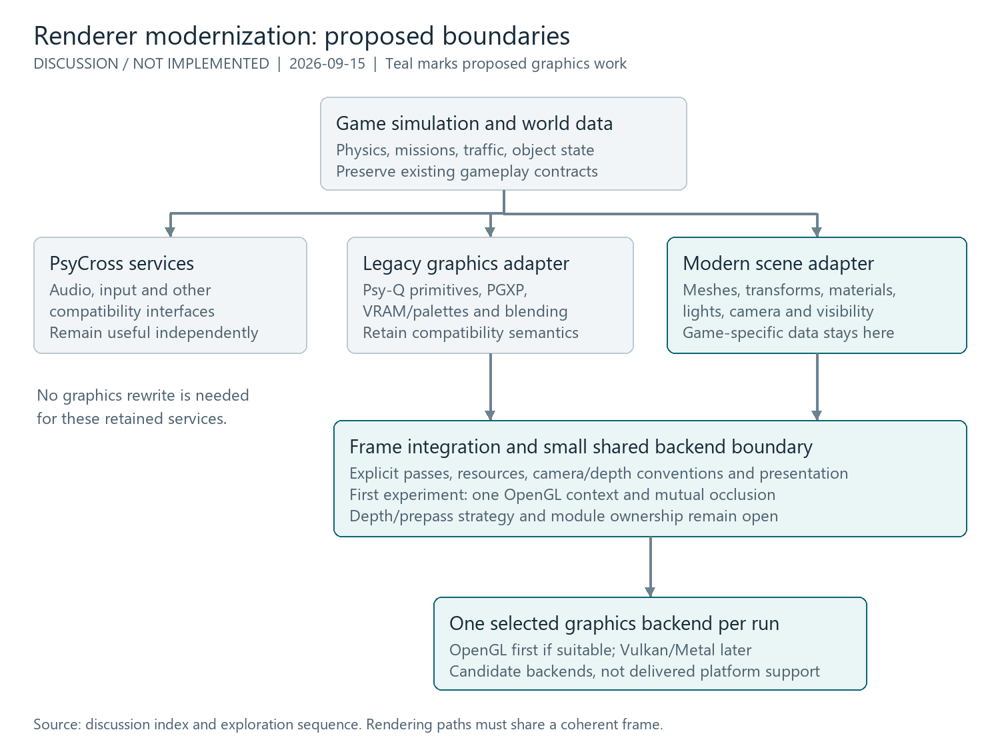

# Renderer modernization while retaining PsyCross compatibility

## Context and decision status

The user wants to explore modern rendering pipelines, modern meshes, PBR
materials, custom lighting, Vulkan/Metal, custom models/maps, and menu changes.
The question is whether PsyCross must be removed to enable this direction.

**Current recommendation:** preserve useful PsyCross compatibility services and
introduce a richer scene submission path alongside the legacy graphics path.
Refine graphics backend boundaries incrementally. Replacing the whole
compatibility layer is not a prerequisite for these goals.

After the initial exploration, the user requested roadmap adoption on 2026-09-15
with the dedicated playground implemented first. The
[renderer roadmap](../../roadmap/planned/renderer-modernization.md) and
[playground roadmap](../../roadmap/done/playable-testing-playground.md)
now govern the staged plan. Playground P1-P4 are the prerequisite for the first
modern in-game mesh slice (R2); renderer audits can happen earlier.
Backend/pipeline choices and hardware budgets remain decision gates.
Creating these records does not start implementation or establish shipped support.

## Reading guide

- [Recommended investigation and development sequence](exploration-sequence.md)
- [Proposed architecture image](diagrams/proposed-architecture.png)
- [Exploration sequence image](diagrams/exploration-sequence.png)
- [Editable diagram generator](diagrams/render_diagrams.py)

## Evidence from the current checkout

Inspected on 2026-09-15: parent HEAD `8058c807`, PsyCross HEAD `e56e4cd`.
The PsyCross working tree contains local integration changes and vendored
ImGui. The parent tree also has unrelated data and ignore-file changes.
These findings describe inspected files, not a clean upstream checkout or
new runtime validation. Recheck the relevant source when implementation starts.
All source links below are relative to this subject directory.

- [Premake](../../../src_rebuild/premake5.lua) compiles game C sources as C++,
  links PsyCross and platform dependencies, and defines platform paths.
  Linux explicitly selects C++11. Windows/Linux, web, and Android paths must
  not be assumed equally validated; macOS is not established as a tested
  game target merely because Metal is a candidate.
- [PsyCross](../../../src_rebuild/PsyCross/README.md) provides Psy-Q-compatible
  graphics, geometry, audio, controller and CD interfaces. Desktop graphics
  use OpenGL, window/input use SDL2, and SPU-AL audio uses OpenAL.
- [Game drawing](../../../src_rebuild/Game/C/draw.c), including
  `PlotBuildingModel`, transforms geometry through GTE and builds PSX
  primitives before the renderer sees the result.
- [GPU translation](../../../src_rebuild/PsyCross/src/gpu/PsyX_GPU.cpp),
  `ParsePrimitivesLinkedList` / `DrawAllSplits`, turns primitive streams into
  batches and ultimately calls `GR_UpdateVertexBuffer` / `GR_DrawTriangles`.
- [GrVertex and GR interfaces](../../../src_rebuild/PsyCross/include/PsyX/PsyX_render.h)
  provide position/projection data, UVs, colours and texture-page/palette
  information. `GrVertex` has no normal, tangent, or PBR material attribute.
  Headers, shader compilation, resource IDs and context setup remain coupled
  to OpenGL; the existing functions are a starting seam, not a backend-neutral
  rendering abstraction ready for Vulkan.
- [MODEL](../../../src_rebuild/Game/engine/mdl.h) includes normal and collision
  fields. Absence of normals in the final vertex stream does not mean the
  original asset has none. Recoverability and quality vary by source path.
- [PGXP data](../../../src_rebuild/PsyCross/include/PsyX/common/pgxp_defs.h)
  retains precision/projection information. It is not a complete world scene
  with persistent objects, materials, lights and off-camera shadow casters.
- [ImGui integration](../../../src_rebuild/utils/DeveloperGraphicsPanel.cpp),
  `DeveloperGraphicsPanel_Initialise`, uses SDL2/OpenGL3 backends; context and
  presentation changes affect it. [PsyX_main.cpp](../../../src_rebuild/PsyCross/src/PsyX_main.cpp)
  also contains direct OpenGL framebuffer readback for screenshots.
- [LoadCarModelFromFile](../../../src_rebuild/Game/C/cars.c) loads external
  `.MDL` car variants. This does not establish arbitrary glTF model import.
  [HD overrides](../../../src_rebuild/utils/HdTextureOverrides.cpp) load
  manifests and PNG texture replacements; image replacement is not a scene
  or material system.
- [Map code](../../../src_rebuild/Game/C/map.c),
  [streaming](../../../src_rebuild/Game/C/spool.c), and
  [level lumps](../../../src_rebuild/Game/C/main.c) carry world/region/road
  assumptions beyond rendering. [Frontend](../../../src_rebuild/Game/Frontend/FEmain.c)
  belongs to the game and can evolve independently of a full PsyCross removal.

## Main architectural distinctions

### Compatibility layer versus graphics backend

Removing PsyCross requires replacing or adapting many interfaces the game
already calls. Replacing its OpenGL backend is narrower, although still a
substantial resource/shader/context/synchronization integration task.
Audio and input need not change just because the graphics backend changes.

### Graphics API versus rendering technique

OpenGL, Vulkan and Metal are graphics APIs. Forward, Forward+ and Deferred
describe how rendering/lighting work is organized. PBR describes material and
lighting models. An API migration does not itself deliver PBR, new content,
or a guaranteed performance improvement.

Forward evaluates lighting during geometry rendering. Forward+ adds spatial
light assignment, often with compute. Deferred stores surface properties in
a G-buffer and lights them later. All can support PBR. Deferred also brings
bandwidth, material representation, transparency and antialiasing tradeoffs.
Compare techniques against actual scenes and supported hardware; do not
implement all of them as an initial goal.

### Scene information versus final primitives

Modern rendering benefits from persistent meshes, object transforms, normals,
materials, lights and camera data. The legacy stream is optimized around PSX
commands and carries less semantic information. Capture richer information
before CPU projection/culling reduces objects to that stream. Normals can
sometimes be recovered; material intent generally needs authored metadata.
Shadow visibility must include relevant off-camera objects, not just visible
triangles submitted for the main camera.

## Proposed direction

Keep game-specific scene adapters, asset identities, materials and lighting
policy in `src_rebuild`. Keep generic compatibility/backend hooks reusable.
The physical home of a modern renderer remains open: a project-owned module
may be preferable to expanding PsyCross's game-specific responsibilities.
Project-specific PsyCross changes now live in the project fork and the parent
gitlink is bumped intentionally ([Track project PsyCross changes in the
fork](../../rules/psycross-fork.md)); the earlier patch-only constraint was
superseded when this work required a native Vulkan backend inside PsyCross.

Use one graphics backend/context for the first hybrid experiment. Legacy and
modern rendering must agree on projection, depth, viewport and frame ownership.
Drawing two images on top of each other is insufficient: a modern object must
correctly occlude and be occluded by legacy geometry. PSX ordering and special
blend behaviour need explicit compatibility treatment; shared depth may require
an adapter or a prepass rather than direct reuse. This is an open technical risk.

The first modern slice uses a synthetic unlit static mesh in the validated
playground, followed by materials and a controllable light. This supersedes the
earlier combined mesh-plus-PBR example. Preserve original assets and simulation;
repeat integration checks in original cities. Use OpenGL initially if its
capabilities suffice; a future backend exercises a meaningful, tested interface.

## Feature implications

- **PBR:** requires material definitions, normals, linear-light evaluation and
  colour-space/output handling. Author suitable base colour/roughness/metallic
  data. Legacy vertex colours and textures may already encode lighting;
  blindly applying new lighting can double-darken or over-light them.
- **Ambient occlusion:** screen-space AO needs usable depth and, depending on
  the algorithm, stored or reconstructed normals. Treat sky, transparent edges
  and HUD separately. A later lighting-aware implementation should affect the
  appropriate indirect component rather than indiscriminately darkening all light.
- **Custom models:** either compile into legacy formats/limits or add modern
  asset loading. Static visuals precede skinned characters and deforming cars.
  Rendering a vehicle is distinct from integrating wheels, collision and damage.
- **Custom maps:** distinguish a visual test scene from a playable city.
  Collision, road topology, streaming, AI, missions and activation ranges are
  game systems requiring dedicated work; glTF geometry alone cannot supply them.
- **Menus:** can change independently. Preserve input focus/capture and
  existing menu actions; the debug ImGui panel does not prescribe the player UI.
- **Vulkan/Metal:** backend choice follows platform goals. Metal implies Apple
  build/platform work as well as rendering. Vulkan through MoltenVK is another
  candidate with capability/portability constraints, not native Metal feature parity.

## Alternatives still open

1. Extend only the legacy renderer: useful for bounded post-processing and
   sampling improvements, but limited for full scene/material semantics.
2. Keep PsyCross services with a parallel modern scene path: recommended
   direction for investigation; hybrid depth and object identity are key risks.
3. Replace the compatibility layer or integrate another full engine: possible,
   but significantly expands migration scope. Reconsider only if evidence shows
   the bridge cannot satisfy the desired product and maintenance constraints.

## Meshy MCP for external PBR test assets

**User-selected workflow, 2026-09-15:** use Meshy through MCP to generate 3D
objects with PBR materials from prompts for the external-asset experiments.
The user reports that the MCP is configured on the implementation agent.
This session has not verified that configuration or generated an asset.

The [renderer roadmap](../../roadmap/planned/renderer-modernization.md) places
this workflow in R3 (static import) and R4 (PBR validation), after the playground
and synthetic geometry/depth bridge. Meshy generation is not a prerequisite for
the procedural floor or simple obstacles. The game will consume retained local
assets; it does not need an MCP connection at runtime.

Discover the actual MCP tool schemas on the configured agent. Request PBR maps
where supported by the chosen generation model, and verify the exported material
references. The [Meshy Text to 3D API](https://docs.meshy.ai/en/api/text-to-3d)
documents PBR controls and GLB output, but model restrictions exist and the MCP
wrapper may expose different names/options. A generated preview alone is not
evidence of correct in-game material setup.

Start with one static prop and a material-focused prompt, for example:
"A single freestanding painted steel bollard, simple cylindrical silhouette,
matte yellow paint with small exposed metal areas, no base scene or text."
This is a draft prompt, not a submitted generation job. Specify actual budgets
through supported settings and inspect the result; the prompt is not validation.

Retain the prompt, parameters/version exposed by the service, task ID, date,
mesh/maps and hashes in fixture metadata. Normalize scale/orientation through
recorded conversion, validate UVs/normals/tangents and PBR channel/colour-space
conventions, and add a separate collision proxy if needed. Keep a fixed object
placement, camera and lighting setup for regression captures. Preserve downloaded
assets rather than regenerating them during tests; outputs may vary for the
same prompt. Keep analytic material samples for diagnosing shader correctness.
Do not store credentials or temporary signed URLs in project knowledge.

This selects the authoring tool, not a final game import format or a graphics
backend. The existing asset import and PBR milestones still need implementation.

## Decisions remaining within the adopted roadmap

- What is the first visible goal: original assets with optional enhancements,
  or new PBR assets in a more remastered art direction?
- What hardware, resolution, frame-time and memory budgets matter first?
- Are Windows/Linux the first experimental targets? When is Apple support needed?
- Which legacy behaviours must remain visually exact in compatibility mode?

The adopted plan starts with a finite playable playground, then an unlit static
mesh/depth prototype, static asset import and PBR. A faithful fallback remains
part of the plan. Hardware/platform details and the final pipeline/backend
choices are pending, with OpenGL on an existing desktop target the initial approach.

## Related project records

- [Playable testing playground discussion](../playable-testing-playground/index.md):
  the first implementation stage and controlled graphics test environment.
- [Playground roadmap](../../roadmap/done/playable-testing-playground.md):
  minimum handoff P1-P4; Take a Ride integration follows at P5.
- [Renderer modernization roadmap](../../roadmap/planned/renderer-modernization.md):
  the adopted staged plan, distinct from bounded legacy graphics improvements.
- [Model round trips](../../roadmap/planned/model-export-import-roundtrip.md)
- [Asset identity](../../roadmap/done/asset-catalog-identity.md)
- [Tool interoperability](../../roadmap/planned/modding-toolchain-integration.md)
- [Draw distance and streaming](../../roadmap/planned/draw-distance-streaming.md)
- [Graphics quality profiles](../../roadmap/planned/graphics-quality-profiles.md)
  explicitly excludes arbitrary PBR conversion and major renderer replacement.
- [Implemented texture alpha semantics](../../product/texture-alpha-semantics.md)

The playground and renderer records document adopted plans, not implemented
features. Other listed plans provide related context and are not blanket
prerequisites for this track. Verify actual dependency evidence before coding.

## External technical references

Consulted during the 2026-09-15 conversation. These establish general technical
capabilities, not features of REDRIVER2-Plus.

- [Khronos glTF 2.0 specification](https://registry.khronos.org/glTF/specs/2.0/glTF-2.0.html):
  mesh attributes and material/asset conventions; a candidate import contract.
- [Khronos PBR overview](https://www.khronos.org/gltf/pbr): metallic/roughness materials.
- [AMD Forward+ example](https://github.com/GPUOpen-LibrariesAndSDKs/ForwardPlus11/):
  per-tile light assignment; its Direct3D sample is not a project dependency.
- [Apple deferred lighting example](https://developer.apple.com/documentation/Metal/rendering-a-scene-with-deferred-lighting-in-c%2B%2B):
  G-buffer lighting and platform-specific implementation considerations.
- [MoltenVK](https://github.com/KhronosGroup/MoltenVK): Vulkan over Metal and
  supported capability subsets; evaluate versions at implementation time.

## R1/R2 implementation evidence (2026-09-18)

The first two milestones were implemented and validated on Windows
`Release_dev` x64 (NVIDIA RTX 3060 Ti, OpenGL 3.3, PGXP on). Item 13 P1-P5 were
re-checked in the source first and the playground was run; the minimum handoff
(P1-P4, scene `playground.flatpad.v1`, 367 objects, spawn `6216,-222456`) holds.

**R1 - scene boundary and contract.** The static-object path was traced:
`MODEL` placement in a cell object -> `DrawMapPSX`/`DrawTILES` -> `draw.c`
(`PlotBuildingModel`, GTE) -> PGXP cache -> `PsyX_GPU` primitive parse ->
`GrVertex` -> `GR_*`. Normal/material semantics are lost before the stream; the
clip-space encoding and depth, however, are fully specified (see the
[bridge rule](../../rules/psyx-modern-mesh-bridge.md)). The legacy 3D vertex
 carries `px,py,pz = camera-axis/128` and `scr_h = C2_H`, normalized by the
 display size, and `Projection3D` maps it to clip space with `clip.w = pz`.

Measured playground baseline at a fixed spawn camera (frame 90): legacy 2040
vertices / 33 draw splits. With the modern path enabled the legacy counts are
unchanged and the add is 1 mesh, 8 vertices, 1 draw call and about 1 us of CPU
submission. GPU frame time and peak memory were not profiled.

The minimal contract adopted for the first slice:

- **Camera/view/projection:** reuse the game's `inv_camera_matrix` (Q12,
  `world -> camera`, `4096 == 1.0`) and `camera_position`; reuse PsyCross's
  captured `Projection3D` verbatim. Units are game world units; winding is
  fixed by drawing without culling; depth is `GL_LEQUAL` in the shared buffer.
- **Mesh:** persistent `VAO`/`VBO`/`EBO`; positions (3 floats) and per-vertex
  RGBA colours for the unlit slice; normals/UVs/tangents deferred to R3/R4.
- **Instance/lifetime:** one persistent mesh, world transform supplied per
  frame as a column-major view matrix; created after the camera is valid and
  owned until shutdown.
- **Material/alpha/lighting:** unlit vertex colour only; no lighting or
  colour-space transform yet; legacy shading untouched.
- **Pass/ownership:** drawn inside `PsyX_EndScene`'s `GR_EndScene`, after the
  legacy scene and before the overlay/swap, in framebuffer 0 with its legacy
  colour and depth; state is saved and restored.

**R2 - hybrid unlit mesh.** A synthetic coloured cube is created without an
importer (`utils/DeveloperModernMesh.cpp`), placed in front of the camera, and
drawn through a new generic PsyCross path (`PsyCross/src/render/PsyX_ModernMesh.cpp`,
public API in `PsyX_public.h`). Evidence on the playground: the cube renders at
its world position and the legacy car and floor occlude it, while it occludes
distant legacy skyline geometry. Setting `enabled=0` in
`developer_modern_mesh.ini` (or pressing F10) restores the exact legacy-only
baseline. An original Chicago launch verified the same bridge: the fixture is
drawn on the road ahead and is partially occluded by legacy street geometry
 while it occludes the background, and the legacy frame is otherwise unchanged.

**R3 - static asset path.** glTF 2.0 / GLB was adopted as the import contract
(open, one file with mesh + textures). A bounded importer
(`utils/GltfLoader.cpp`) handles one mesh primitive with float
POSITION/NORMAL/TEXCOORD_0, 16/32-bit indices and one pbrMetallicRoughness
material with an embedded base-colour image (decoded through WIC). Six owned
Meshy fixtures were generated and retained under `assets/modern_fixtures/`
with `provenance.md`; the material id is derived from the file name plus the
base-colour factor, independent of PSX texture addresses. Verified in the
playground: `bollard.glb` (2220 verts / 1479 tris) and `wooden_crate.glb`
(1822 verts / 860 tris) import with their 2048x2048 base-colour texture and
draw through the modern path with the legacy floor occluding their lower half.
`DeveloperModernMesh` selects a fixture through `developer_modern_mesh.ini`
(`asset=...`) and falls back to the synthetic cube when no asset is set.

Open questions carried forward: the first target hardware/frame-time budgets,
a shared-depth prepass if a modern material needs more than the fixed
`Projection3D`, and PBR maps/lighting (R4) on top of the imported base colour.

**R4 - reference PBR.** The modern fragment path became a simple Forward
metallic/roughness shader: sRGB->linear decode of the base colour, GGX
specular with Schlick Fresnel, a small ambient term, one directional light and
an exposure multiplier, output back to sRGB. It consumes the imported normal map
(tangent frame reconstructed from screen-space derivatives, so no vertex
tangents are required) and the metallic/roughness map (G/B). Meshy PBR fixtures
(`bollard_pbr.glb`, `oil_barrel_pbr.glb`, 20 credits) embed all three maps and
were imported and drawn with visible metal/rust response, alongside four
procedural analytic spheres (dielectric/metal across smooth/rough) that validate
the shader without textures. The legacy path is untouched and the toggle still
restores the baseline; light direction, intensity, ambient and exposure are set
from `developer_modern_mesh.ini`. Real-time light add/remove is R5.

**R5 - lighting effects.** The modern path now takes a light set (up to eight
directional/point lights, colour, intensity, range) plus ambient and exposure.
A directional shadow map (2048x2048 depth FBO, orthographic volume) renders the
modern meshes as casters and receivers; legacy geometry deliberately does not
participate, so coverage is explicit. Emissive factors/textures from glTF are
added to the output, and a normal-based ambient-occlusion approximation is a
separate toggle. In game, `[`/`]` rotate the sun, `;`/`'` change its elevation,
`-`/`=` change exposure, `0` toggles shadows and `9` toggles AO; all values
persist. This satisfies "add/modify/remove lights, move the sun and configure
per-object emission" with a bounded modern-only shadow/occlusion scope.

**R6 - pipeline decision.** Retain the reference **Forward** path as the initial
production choice. The modern scene budget is small (at most eight lights, one
shadow-casting directional), the Forward shader costs about 5 us of CPU
submission for five meshes in the playground, and the stated base GPU (GTX
1050 Ti / RX 460) has ample headroom at PSX-scale content; Forward+/clustered
and Deferred would add bandwidth and material/lifetime complexity without a
demonstrated need at these light counts. The decision is revisitable if light
counts or the quality target grow. The classic/enhanced switch is now a
persisted developer Graphics-panel setting ("Enhanced renderer") plus the F10
key, and it toggles live without reloading; shadows and AO are separate
checkboxes and keys.

**R7/R8 - backend portability and regression.** No second graphics backend was
implemented; that remains a pending platform/API decision plus a dedicated
port, not a claim. Regression on Windows `Release_dev` x64: 0 failed projects,
inspector suites 145 + 104 checks, `git diff --check` clean, PsyCross patch
reverse-checks and the gitlink is unchanged. Playground and one original city
were exercised with the modern path on and off; CPU/GPU frame time, peak memory
and non-desktop targets were not profiled.

## Discussion history

### 2026-09-15 - Technology inventory and compatibility question

Reviewed C/C++, PsyCross, SDL2, OpenGL/GLSL/GLAD, GTE/PGXP, OpenAL/SPU-AL,
ImGui, JPEG/AVI, WIC image handling and build tooling. Explained that replacing
PsyCross is possible but not required for graphics modernization. Identified
the final vertex stream's missing modern material/normal data and recommended
investigating a richer scene path. No new renderer was selected or implemented.

### 2026-09-15 - Persistent discussion and recommended sequence

User requested a durable discussion folder, image diagrams and automatic
updates as the same subject develops. Created this synthesis and the staged
exploration note. Refined the recommendation: prove shared camera/depth and
legacy compatibility before PBR complexity; evaluate pipelines and APIs through
separate gates; custom playable maps remain a distinct gameplay/tooling effort.
The user explicitly requested exploration before a new roadmap entry.

### 2026-09-15 - Companion playable playground

The user endorsed the sequence as a sound direction and asked whether a separate
flat driving playground could be generated in code or JSON and selected through
Take a Ride. Opened a linked discussion with source evidence for level loading,
wheel surfaces, object collision and frontend integration. No new roadmap scope
or implementation was requested. A playable playground can help repeatable
graphics experiments, but is not required before the synthetic rendering slice;
it adds world initialization and collision work of its own.

### 2026-09-15 - Adopt playground-first execution

User requested linked roadmaps and chose the dedicated playground before modern
rendering work. Created a renderer roadmap because the previous record was a
discussion only; the existing graphics-quality roadmap excludes broad renderer
replacement. The new track is playground P1-P4, then renderer R2 and later work.
P5 menu integration can proceed after handoff without blocking rendering. This
supersedes the prior optional-playground recommendation. Original-city tests
remain necessary; the controlled fixture alone cannot cover streaming and all
legacy effects. No implementation was performed.

### 2026-09-15 - Meshy MCP selected for generated PBR fixtures

User asked to include prompt-based Meshy generation in the rendering discussion
and roadmap and stated the MCP is configured on the implementation agent.
Added the workflow to R3/R4 with local fixture retention, material validation and
provenance. This does not request generation in the documentation task or add
a runtime service dependency, and does not block the minimum playground.

### 2026-09-18 - R1 contract and R2 hybrid mesh implemented

Audited playground P1-P5 in source and ran it, then delivered the R1 contract and
the R2 unlit hybrid mesh. Traced the legacy 3D vertex/depth encoding and reused
`Projection3D` plus the game camera basis to share depth; a synthetic cube now
mutually occludes with the legacy car/floor/skyline in the playground, with an
`enabled` ini toggle and F10 restoring the baseline. Recorded the durable
conventions in [`psyx-modern-mesh-bridge.md`](../../rules/psyx-modern-mesh-bridge.md).
The original-city visual repeat and all R3/R4 asset work remain open; R3/R4 need
a separate authorization and Meshy credit confirmation.

### 2026-09-18 - Fixture gallery, world anchoring and legacy shadow reception

User feedback after the R3-R6 delivery drove three fixes and one new feature.
All were implemented in the modern path and verified on a Windows
`Release_dev|x64` build with 0 failed projects.

**Camera-relative swimming (root cause).** The fixture update ran at the start
of `StepGame`, before `ModifyCamera`/`InitCamera`/`RenderGame2` recompute the
frame's camera, so every instance used the previous frame's camera and the mesh
appeared to slide relative to the legacy scene. The update now runs in
`DrawGame` after `RenderGame2` and before `PsyX_EndScene`, i.e. with exactly the
camera the legacy scene was drawn with; the analytic spheres no longer re-layout
from the live camera either. This is the anchoring rule now recorded in
`psyx-modern-mesh-bridge.md`.

**Gallery and grounding.** The single barrel became a fixed gallery of all eight
owned Meshy GLBs (six base-colour, two PBR) plus the four analytic material
spheres, laid out once from the spawn pose. Each glTF is grounded by its own
bounding box at `MapHeight(x,z)`, so the base rests on the surface instead of
half-sinking. Logged dimensions confirmed Meshy's ~1.9 m normalisation
(e.g. bollard 245x760x245 units, barrier 760x311x365 at 400 units/m), and the
baseline changed from 1 mesh to 12 meshes / 18 915 vertices / 12 draw calls.

**Legacy shadow reception (new).** The modern shadow map is now projected onto
the already rendered legacy scene, so modern objects cast shadows onto scenery
instead of only onto themselves. The implementation copies framebuffer 0's
depth (as `GL_DEPTH24_STENCIL8`; a plain depth target makes the blit fail
silently), reconstructs world positions through the inverse `Projection3D` and
the inverse camera view, and multiplies the framebuffer with a 3x3 PCF shadow
term. `PsyX_ModernMesh_SetCamera` feeds the frame's final camera; the pass runs
after the legacy scene and before the modern meshes so those are not darkened
twice.

Diagnosis notes worth keeping: the shadow map must be rendered through the
instance *world* matrix (`SetInstanceWorld`) - the first version rendered
casters at the world origin and no shadow appeared; the composite must disable
the legacy scissor state; and the legacy 2D path writes a constant 0.5 depth, so
pixels at 0.5 are excluded or the HUD is darkened. Shadow visibility depends on
the sun direction: with the light behind the objects relative to the camera the
shadow hides behind the caster, which is why an early normal-strength test
looked like "no shadows" until the sun was rotated.

**Verification.** Debug modes (`shadowdebug` in `developer_modern_mesh.ini`, or
key `7`) were added for this: 1 = scene depth, 2 = shadow-volume membership,
3 = shadow map, 4 = receiver vs caster depth. They showed the ground inside the
volume, the full gallery in the shadow map, and a numerically correct light
matrix (centre base 0.5000, top at 760 units 0.4649). With a sun facing the
camera the street lamp casts a hard black shadow across the ground and the tree
canopy at strength 1.0; the shipped strength is 0.45.

**Open items.** Legacy shadow *receiving* is in; making legacy geometry react to
the modern *lighting* (not just shadows) is the next track, recorded as its own
planned roadmap item. The AO term is still a normal-based approximation on the
modern path only. R7 (Vulkan) and the R8 handoff remain.

### 2026-09-18 - Native Vulkan slice for the modern scene (R7, in progress)

The user selected native Vulkan (latest version first) and then MoltenVK for
macOS. A self-contained Vulkan backend for the modern scene landed, plus a
standalone developer window (`-vkfixture`) that loads the same eight Meshy GLBs
and four analytic spheres as the OpenGL fixture.

**What works (Windows/NVIDIA, verified).** Initialisation negotiates Vulkan
**1.4.0** - the newest API the loader reports, honouring "latest version first".
The slice owns its SDL window, surface, swapchain (FIFO, sRGB when available),
depth buffer, 2048 shadow map, PBR and depth pipelines, per-mesh descriptor
sets, host-visible vertex/index/UBO buffers, texture uploads, resize, RGBA
readback, and an ImGui overlay through the vendored `imgui_impl_vulkan` backend.
Twelve meshes are created from the shared modern-mesh description; 40 frames
were rendered and a screenshot read back and written.

**Build model.** The build needs the Vulkan **headers only**: the loader is
resolved at runtime through SDL (`SDL_Vulkan_LoadLibrary`), so there is no
import library, SDK or validation-layer dependency. ImGui's Vulkan backend is
compiled with `IMGUI_IMPL_VULKAN_NO_PROTOTYPES` and fed the same loader. SPIR-V
is embedded from `PsyX_Vk_Shaders.h`, regenerated by
`scripts/compile_vk_shaders.ps1` (glslang). On macOS SDL resolves MoltenVK, so
the same source is the portability path, but no macOS build has been produced.

**Root cause of the missing draws (fixed).** With the Vulkan SDK installed, the
Khronos validation layer named it immediately:
`vkCreateRenderPass(): pCreateInfo->pAttachments[0].format is
VK_FORMAT_UNDEFINED`. `CreateRenderPasses()` ran *before* `CreateSwapchain()`,
so the main pass captured `g_vk.swapchainFormat` while it was still undefined.
A pass with an undefined colour attachment accepts the framebuffer creation
that follows (with a format mismatch warning), records every draw and then
discards all of them - exactly the "clear works, nothing rasterises" symptom.
Negotiating the surface format first (`QuerySwapchainFormat()` before
`CreateRenderPasses()`) fixed it: the fixture now renders the full gallery with
zero validation errors. A second, cosmetic defect was found in the same pass:
`PsyX_Vk_ReadbackRgba` flipped the rows even though it documents a top-left
origin, so `-vkshot` produced upside-down BMPs; the flip was removed.

Verified with the validation layer active
(`VK_INSTANCE_LAYERS=VK_LAYER_KHRONOS_validation`): 12 meshes / 12 draws, clean
frame, screenshot showing the eight GLBs, four spheres and the ImGui overlay.
The OpenGL modern path and the game were unaffected by the fix.

**Durable conventions** for the Vulkan backend live in
[`psyx-modern-mesh-bridge.md`](../../rules/psyx-modern-mesh-bridge.md).

### 2026-09-18 - Emulated PSX GPU path phase 1 on Vulkan (R7b, started)

With the modern gallery rendering, work moved to the second half of the
objective: the game image itself on Vulkan. Because the game drives the
emulated PSX GPU through the `GR_*` seam in `PsyX_render.h`, the port is
planned in three phases (recorded in
[`vulkan-game-renderer.md`](../../roadmap/done/vulkan-game-renderer.md)):
(1) VRAM, RG8 table, PSX shaders and pipelines validated by pixel assertions;
(2) the `GR_*` state machine and the game window (geometry, textures, depth,
blends, presentation); (3) parity work (offscreen render targets, the
framebuffer-to-VRAM store, stencil, save/load VRAM and the FMV shader).

**Phase 1 is done and verified.** `vk_shaders/psx.vert` reproduces the GTE
vertex path (packed `GrVertex` with PGXP, `a_zw.y > 100` selecting the 3D path,
`v_z`, and the GL-to-Vulkan clip conversion `y = -y`,
`z = (z + w) * 0.5`), and `psx.frag` merges the 4/8/16/32-bit fragment programs
with the CLUT lookup, texture window, dither and in-shader bilinear filter.
`PsyX_Vk_Game*` models VRAM as `R32G32_SFLOAT` (R = low byte / 255,
G = high byte / 255, matching the GL `GL_RG`/`GL_UNSIGNED_BYTE` upload of the
same mirror), builds the 256x256 RG8 table, and creates five blend pipelines
plus a no-depth variant, with `BM_SUBTRACT` as reverse subtract on colour only
and `BM_ADD_QUATER_SOURCE` through `CONSTANT_ALPHA`.

`REDRIVER2_dev.exe -vkpsxtest` renders synthetic PSX quads and asserts the
readback: a 16-bit `0x001F` word reads back `(252,0,0,255)` and a 4-bit texture
whose nibbles are all 5 with CLUT entry 5 blue reads back `(0,0,252,255)`, with
**zero validation errors**. The 4-bit case is a real decode check: a wrong
nibble index, CLUT row address or RG8 row produces a shown colour drift and
fails. Two defects were caught by exactly this test rather than by eye: the RG8
sampler wrapped (a zero high byte sampled the last table row, turning red into
magenta) and `discard` in the fragment shader compiled to
`OpDemoteToHelperInvocation`, which needs a device feature that is not enabled
(`VUID-VkShaderModuleCreateInfo-pCode-08740`); the sampler now clamps like GL
and the fragment shader is compiled for `vulkan1.1` so `discard` becomes
`OpKill`.

Regressions were re-run after the change: the modern Vulkan fixture still draws
12 meshes with zero validation errors, and the OpenGL game still reports
`legacyShadowPass=1` with 12 modern meshes. Not yet covered: 8-bit textures, the
texture-window and bilinear paths, offscreen passes, VRAM feedback, and the game
window itself.

### 2026-09-18 - Project PsyCross fork, SDL3 question, and game-image parity

The user created a project fork of PsyCross (`SimStm/PsyCross`), asked for the
submodule to track it, and for project changes to be committed there instead of
shipped as patches. Done: the fork now carries the Vulkan backend, the developer
panel hooks, the modern mesh path and vendored Dear ImGui; the submodule
`origin` points at the fork with `upstream` kept for OpenDriver2 commits, and the
parent gitlink was bumped to `49f9578`. `patches/psycross/` and
`scripts/apply_psycross_patches.ps1` were removed and the prepare scripts now
initialise the submodule; the rule is now
[`psycross-fork.md`](../../rules/psycross-fork.md).

The user also asked whether to migrate SDL2 to SDL3. Recorded separately in
[`sdl-version-migration`](../sdl-version-migration/index.md): recommendation is
to defer, because Vulkan does not require SDL3 and the migration is a broad API
break across ~93 `SDL_`-using files plus the Emscripten/Android toolchains.

On the game image (phase 2), the "mirrored lower half" was diagnosed as a
Vulkan vertex-capacity bug, not a reflection: `PSYX_VK_PSX_VERTEX_CAPACITY` held
only 5,957 vertices (256 KiB / 44 B) while the game submits roughly 11,532 per
frame, so draws were truncated. Raising the capacity to match the OpenGL
`MAX_VERTEX_BUFFER_SIZE` (65,536) removed ~1.95M out-of-range drops and made the
Vulkan image match OpenGL (car, HUD, scenery). A second limit,
`PSYX_VK_PSX_MAX_TEXTURES`, was raised from 64 to 512 to clear 28 "out of PSX
game textures" warnings. The remaining visible gap is the bottom-right minimap
(`overmap.c`, a 4-bit CLUT "OVERHEAD" VRAM texture uploaded through
`LoadImage`), and the framebuffer-to-VRAM readback (`GR_StoreFrameBuffer`,
`PsyX_Vk_GameStoreFrameBuffer`) is still a no-op, so framebuffer-sourced effects
stay stale. Neither is yet root-caused.

### 2026-09-18 - Minimap scissor fix and the VRAM frame mirror

The two gaps left by the previous entry are closed.

The minimap was the scissor, not the texture. `GR_SetupClipMode` computes the
clip rectangle in GL's bottom-left window space and hands the same values to
`glScissor` and to `PsyX_Vk_GameSetScissor`. `RecordPsxDraws` applied them
unchanged as a Vulkan top-left scissor, so every clipped element tested a
vertically mirrored region; the minimap's 63x60 bottom-right clip fell outside
the tested area and the draw was discarded. Mapping the scissor Y like the
viewport (`height - (y + h)`) restored it, confirmed by a screenshot with the
minimap present and the rest of the frame unchanged. This affects every clipped
HUD element, not just the minimap.

`GR_StoreFrameBuffer` now mirrors the frame into VRAM. Vulkan presents into its
swapchain, so the readback buffer already holds the presented frame top-down.
`PsyX_Vk_GameStoreFrameBuffer` records the display rect; at the start of the
next scene `GR_VkMirrorFrameToVRAM` consumes it through the new
`PsyX_Vk_TakeStoredFrameBuffer`, converts the BGRA/RGBA pixels to 5551 at
(disp.x, disp.y) and raises `vram_need_update` so the CPU mirror is re-uploaded.
The orientation was checked against the GL path rather than assumed: the GL blit
plus `glGetTexImage` also yields a top-down image written with `flip_y=0`, so
the Vulkan conversion is top-down too. That closes the sky lens flare's
`DR_MOVE`/`StoreImage` pipeline, which samples the screen through VRAM.

Verified: zero Khronos validation errors in an original Chicago launch, the image
matches the OpenGL backend, `AssetCatalogTests` 145/0,
`InspectorExportTests` 104, and the `-vkpsxtest` self-test still passes. Still
open for phase 3: offscreen mirrors (`GR_SetOffscreenState` is a state no-op),
stencil masking, the save/load VRAM export paths and the FMV shader.

### 2026-09-18 - Vulkan offscreen render-to-VRAM target

The `GR_SetOffscreenState` gap is closed. The Vulkan no-op is replaced by a real
render-to-VRAM target: `PsyX_Vk_GameSetOffscreen` opens a colour-only target
(`VK_FORMAT_R8G8B8A8_UNORM`, no depth, its own render pass and five depth-less
pipelines because a pipeline is bound to the render pass it was created with),
queued draws are tagged `offscreen`, and `PsyX_Vk_GameResolveOffscreen` (called
from `GR_EndScene`) renders each group, copies it back through a host-visible
buffer, packs 5551 (`alpha = word != 0`, matching the texture decode) and writes
it into the PSX VRAM mirror at the group rect, then re-uploads the VRAM image so
draws later in the same frame sample the result. This mirrors the GL path's
synchronous offscreen blit and closes the Tanner pedestrian shadow
(`motion_c.c` `TannerShadow`, `drEnv.dfe = 0`, sampled via
`getTPage(2,0,...)` in the same frame).

Two implementation notes cost iterations. First, `psx.vert`'s UVs are raw VRAM
texture coordinates, so the offscreen pass uses an identity-like viewport and
the group rect, not the window dimensions. Second, and the real root cause of a
uniform mid-grey result, `RecordPsxDraws` was iterating `[firstDraw,endDraw)`
while filtering by frame index, so only one draw candidate was ever considered
and the offscreen pass silently cleared. The fix filters all queued draws by
`draw->frame` as well as `draw->offscreen`. Groups are bound to the frame index
(the game builds the display list one frame ahead of the presented one), which
keeps the double-buffered structure intact.

Verified: `-vkpsxtest` now renders a 32x32 quad offscreen and asserts the packed
VRAM word at (64,64) (`0x801F` red, three sample points) - PASS with zero
validation errors; the game still presents the OpenGL-matching image under
`-vulkan`; `AssetCatalogTests` 145/0 and `InspectorExportTests` 104 still pass.
An in-game screenshot was not captured from the automated run because the debug
start leaves the player in the car (`DrawTanner` only runs for a visible
`TANNER_MODEL` pedestrian, and `TannerShadow` also returns early for
`gDemoLevel`). Follow-up: an on-foot test by the user confirms the Tanner shadow
renders correctly on the Vulkan path - it is slightly smooth at the edges but
present. The game calls `GR_SetOffscreenState` every frame (observed on the
`enable=0` restore path), and the identical offscreen code path is covered by
the self-test. Next in phase 3: stencil masking, save/load VRAM export and the
FMV shader.

### 2026-09-18 - PSX primitive mask bit on Vulkan

`GR_SetStencilMode` is the last state call that Vulkan stored but never used.
It is now real. The GL renderer keeps the stencil test enabled for every draw:
the mask-bit draw (`GL_ALWAYS`, `GL_REPLACE`, mask `0x10`) writes bit 4, and
every other draw uses `GL_NOTEQUAL`/`GL_KEEP` against stencil `1`, so a masked
region is hidden from later geometry. That path is live in the game - `DrawPrim`
reaches `ParsePrimitivesLinkedList(p, 1)` and is used by the minimap/map overlay
(`overmap.c`) and `loadview.c`.

Vulkan bakes stencil state into the pipeline, so the port needed three things.
First, the main pass depth attachment now prefers `D24_UNORM_S8_UINT`
(`PickDepthStencilFormat`) instead of `D32_SFLOAT`, with the stencil aspect
cleared to zero every frame; `D32_SFLOAT` stays as a fallback on drivers without
a combined format, where the mask degrades to a no-op. Second, `CreatePsxPipeline`
took a `stencilMode` argument and the backend owns a second pipeline per blend
mode for the mask-set case (`pipelinesStencilWrite`), matching the fact that a
pipeline is fixed to one render pass and one stencil state; the offscreen pass
passes `-1` because it has no depth-stencil attachment. Third, the queued
`VkPsxDraw` carries `stencilMode` captured from `stStencilMode` at queue time and
`RecordPsxDraws` selects the variant.

A one-shot diagnostic now logs `main pass recorded draws=N stencil=M` so the
mask traffic is observable without a debugger. Verified on an original-city
`-vulkan` launch: the log reports the `D24_UNORM_S8_UINT` format (129) with
`stencil=1`, zero validation errors, and a screenshot with the scene, HUD and
the `DrawPrim`-composed minimap all correct; `-vkpsxtest` still passes,
`AssetCatalogTests` 145/0 and `InspectorExportTests` 104. On an NVIDIA driver
the format is always stencil-capable, so the `D32_SFLOAT` fallback path is
compiled but not exercised on this machine. Still open for phase 3: save/load
VRAM export and the FMV shader.

### 2026-09-18 - VRAM export fix and the FMV scope question

Two phase-3 items were re-examined against the source rather than the earlier
notes.

The "FMV shader" item does not exist on the desktop path. `PlayRender` only runs
the FMV through `FMV_main` when built for desktop, and `playn`/`nplay` reference
`n\\n.EXE` and `nplay.h`, neither of which is in this clean-room tree; the PSX
branch is `#ifdef PSX` and its `Exec` path is commented out. There is no FMV
shader to port into the Vulkan backend, so the item was based on a wrong
assumption and is dropped from the phase-3 list. The lens flare's VRAM sampler
(`sky.c` `StoreImage` on `sun_source`) reads the CPU mirror that
`GR_VkMirrorFrameToVRAM` already keeps current, so it is covered.

The real remaining item was `GR_SaveVRAM` (F10, VRAM.TGA). It read the CPU `vram`
mirror but its pixel loop was inside `#if USE_OPENGL`, and the Vulkan build
reports `USE_OPENGL 0`, so the export was a 18-byte header-only file. Since the
mirror is backend-agnostic the writer now runs on both backends; the
`-vkpsxtest` self-test gained Case 4 to guard it. The first attempt failed to
link because the self-test's local declaration lacked `extern "C"`, giving the
reference C++ mangling while the definition is C; the declaration now lives at
file scope with C linkage (and a comment explaining why it does not include
`PsyX_render.h`). A transient link failure with 340 unresolved PsyCross symbols
was a stale/partial `PsyCross.lib` from a single-project build; the current
solution builds with 0 failures.

Verified: `-vkpsxtest` reports `vram export 1048594/1048594 bytes: ok`
(18 + 1024x512x2) and PASS, an original-city `-vulkan` launch still renders with
zero validation errors, `AssetCatalogTests` 145/0 and `InspectorExportTests` 104.
With the FMV question answered, the phase-3 state/lookback list is empty; the
next open work is the documented performance/limitation comparison and the
remaining modern-renderer roadmap items (R8+).

### 2026-09-18 - Backend performance comparison and the mip-barrier defect

The documented OpenGL/Vulkan comparison was built on a shared instrument rather
than the ImGui overlay, because synthetic input never reaches the panel. A
wall-clock sample was added to `PsyX_EndScene`, the one point both backends pass
through once per presented frame, written to `psyx_perf.log` only when
`PSYX_PERF_LOG` is set. An initial version gated the emit on both the window
timer and the per-frame timer, so the second condition was never true and
nothing was written; the window timer alone now drives it.

Measured on an RTX 3060 Ti at 1280x720, same binary, original-city start
(30 one-second windows each): OpenGL and Vulkan both settle at 30.0 FPS /
33.37-33.43 ms with the same vertex counts (11298 -> 13476) and draw splits
(1295 -> 1595) frame for frame. The 30 Hz ceiling is the game's own PSX timestep,
not the GPU, so on this level both backends have equivalent headroom and no
player-visible performance difference exists. The fixture remains the throughput
proxy if uncapped numbers are ever needed.

Capturing a real game run also exposed a correctness defect that the fixture
self-test did not cover. `PsyX_Vk_GameCreateTexture` generated mip chains with
whole-image layout barriers: the upload left mip 0 as `TRANSFER_DST`, one
image-wide barrier then forced every level to `TRANSFER_SRC`, the next level was
blitted in as `TRANSFER_DST` against that layout, and the generated mips were
never moved to `SHADER_READ_ONLY` before sampling. Validation reported
`oldLayout-01197`, `vkCmdBlitImage-srcImageLayout-00221` and
`vkCmdDraw-None-09600`, thirty messages capped by the duplicate limit, on every
run that loaded a mipmapped PSX texture. Barriers are now issued per mip level
(mip 0 DST->SRC once, each new level UNDEFINED->DST, then DST->SRC) and the
final transition uses the level-range helper so every level reaches
`SHADER_READ_ONLY`; the single-level helper had left mips 1..N behind, which was
the source of the remaining `09600`. A game run now reports zero validation
errors. The gallery fixture was re-verified from a capture: 12 meshes, 12
instances, shadow map 2048, ImGui on, and a screenshot with the eight textured
GLBs, the four analytic spheres and correct lighting.

This changes the earlier claim that the game path had zero validation errors;
that was true of the fixture, not of a full game run that loads mipmapped
textures. The comparison and the fix are recorded together because the same run
produced both.

### 2026-09-18 - Resize recreation was incomplete

Reviewing the resize path against the objective's explicit "presentation, resize,
readback and ImGui" requirement found a second game-path defect. The
`SDL_WINDOWEVENT_SIZE_CHANGED` handler (and the out-of-date branch after
`vkAcquireNextImageKHR`) called only `DestroySwapchain()`, which destroys the
swapchain handle and nothing else. The framebuffers, swapchain image views and
depth image built for the previous extent stayed alive; the subsequent
`CreateSwapchain()` created new ones over them, so each resize leaked a full set
of those objects and the new framebuffers ended up alongside stale attachments.
`DestroySwapchainResources()` already existed and did the right teardown, and
shutdown already called it - only the live-resize path skipped it.

Both call sites now go through `RecreateSwapchain()`: idle, destroy the
framebuffer/view/depth resources, destroy the swapchain, recreate at the new
extent (the readback buffer is rebuilt inside `CreateSwapchain` and was already
handled). The recreate logs its extent so the behaviour is observable rather than
inferred.

Because synthetic input never reaches the game window, the resize was driven
externally with `user32!MoveWindow` on the live process while capturing its
output. Four resizes (1024x768, 800x600, 1600x900, 1280x720) produced four
recreations at the matching client extents - 1008x729, 784x561, 1584x861,
1264x681, three images each - with zero validation errors, and the frame counter
kept advancing across all of them (frames 360/480/600 presented at 29.4-29.9
FPS with draw counts 1100 -> 1437 -> 1564), so the game neither stalled nor
crashed. This confirms the "resize" requirement on the Vulkan game path.

### 2026-09-18 - Vulkan becomes the default backend

The backend was opt-in behind `-vulkan` with OpenGL as the default "until parity
is proven". Every parity item named in the phase plan is now verified - image,
resize, readback, primitive-mask stencil, offscreen render-to-VRAM, VRAM export,
zero validation errors, and measured 30 FPS equality - so the conditional is
satisfied and the default is flipped. `redriver2_psxpc.cpp` now defaults
`useVulkan = 1` on desktop builds, adds `-opengl` as the explicit OpenGL
opt-out, and keeps `-vulkan` accepted for compatibility; the platform guard
(`!defined(PSX) && !defined(__ANDROID__) && !defined(__EMSCRIPTEN__)`) matches
the one that compiles the backend out, so those targets keep OpenGL by default
rather than attempting a Vulkan init that cannot succeed. A driver without a
usable Vulkan device still falls back automatically via the existing failure
path in `PsyX_InitialiseRender`.

Verified on the default path (no arguments): the game window initialises Vulkan
(`psyx_vk.log` shows `initialise: instance/surface/physical device`) and renders
at 29.4-30.7 FPS with zero validation errors, matching the OpenGL figures. With
`-opengl` no `psyx_vk.log` is produced, confirming the OpenGL path is selected;
`-vulkan` still selects Vulkan. Both VS configurations were re-pointed:
`Release_dev|x64` passes no arguments (Vulkan default) and `Release_dev_gl|x64`
passes `-opengl`.

### 2026-09-19 - Post-flip defects resolved; the record is complete

After the default flip the user reported four defects. All are now fixed and
verified, so the Vulkan game renderer record moved to
[`roadmap/done/vulkan-game-renderer.md`](../../roadmap/done/vulkan-game-renderer.md)
with its product document
[`knowledge/product/vulkan-game-renderer.md`](../../product/vulkan-game-renderer.md):

- **Defect 1 (loading screen black).** The main pass always used `LOAD_OP_CLEAR`
  and the `clearRequested` flag was dead, so the loading art drawn once by
  `ShowLoadingScreen` was wiped while `ShowLoading` redrew only the bar. The pass
  now loads and preserves the previous frame (`PRESENT_SRC` initial layout) and
  clears with `vkCmdClearAttachments` only when `GR_Clear` was requested,
  matching OpenGL's conditionally-cleared framebuffer.
- **Defect 2 (washed-out colours)** was the sRGB double-encode fixed earlier
  (fork `837573a`).
- **Defect 3 (modern meshes absent on Vulkan)** was ported under Option A: the
  in-game modern-mesh system now dispatches to `PsyX_Vk_GameModernMesh*` with new
  `psx_modern`/composite shaders, so R2-R4 are delivered in the default
  configuration. The initial invisibility was a std140 mismatch: the vertex
  shader's `ModernUBO` was missing `ambientExposure`, shifting `cameraPos`.
- **Defect 4 (texture preview)** got a backend-aware accessor that returns a
  cached `ImGui_ImplVulkan_AddTexture` descriptor set on Vulkan and the `GLuint`
  on OpenGL; the preview is verified on Vulkan.
- **Defect 5 (screenshots)** was fixed during the work (fork `55ded1f`).

R5 and R6 were restated for the Vulkan-default configuration, and R8's profiling
gaps (frame-time distribution, peak memory, Linux/web/Android builds) remain
explicitly non-blocking. No decision here is reversed; the discussion's direction
is delivered for the backend port.

